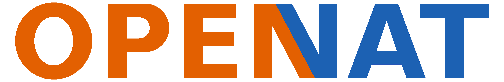
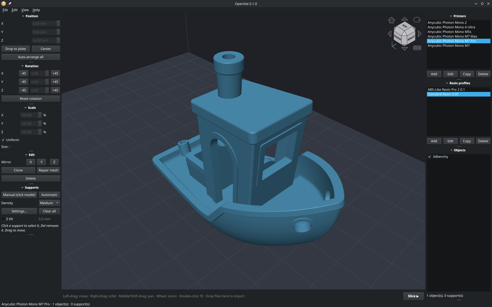

A FOSS resin slicer with support for Anycubic **`.pwsz`** (`.pwsz`, `.pm7`, `.pm7m`, `.pm4u`, `.pp1`, `.pp1m`) and binary files of versions 1, 516 and 517 (**`.pwx`**, `.pw0`, **`.pm3m`**, `.pm3`, `.pwmx`, `.pwma`, **`.dl2p`**, `.pwmb`, `.pm3r`, `.pm3n`, `.pm4n`, `.pm5`, `.pmx2`, `.px6s`, ...).  
Runs on Linux, Windows and macOS.



## Installing

See releases

## Running

Without installing (from source):

```
# download & extract OpenVat, then
pip install -r requirements.txt 
python run.py 
```

<details>

<summary>Install as a python module (optional)</summary>

```
pip install -e .
openvat # GUI
openvat-slice model.stl -o model.pwsz --printer "Anycubic Photon Mono M7 Pro" --resin "Anycubic Standard Resin (ACF, Normal 0.05 mm)"
openvat-slice --list-profiles
openvat-slice --import-presets "Anycubic Photon Mono M7.pwsp"
openvat-slice --inspect model.pwsz
```

STEP/IGES import needs CadQuery: `pip install cadquery` (large download).

</details>

## Compatibility Matrix

**Please** open an issue with your printer model if you can confirm it working or have problems.

| Printer | File | Format | Status | Checked against a true output |
|---|---|---|---|---|
| Elegoo Printers | ... | ... | Support planned, looking for someone to test | ... |
| Phrozen Printers | ... | ... | Support planned, looking for someone to test | ... |
| Anycubic Photon Mono M7 Pro | `.pwsz` | ZIP, vector layers | 🟩 Confirmed working | yes |
| Anycubic Photon Mono M7 | `.pm7` | ZIP, vector layers | 🟨 Likely supported | no |
| Anycubic Photon Mono M7 Max | `.pm7m` | ZIP, vector layers | 🟨 Likely supported | no |
| Anycubic Photon | `.pws` | binary v1, pwsImg bitmaps | 🟧 Experimental | yes |
| Anycubic Photon D2 | `.dl2p` | binary v517, pw0Img bitmaps | 🟧 Experimental | yes |
| Anycubic Photon M3 | `.pm3` | binary v516, pw0Img bitmaps | 🟧 Experimental | no |
| Anycubic Photon M3 Max | `.pm3m` | binary v516, pw0Img bitmaps | 🟧 Experimental | yes |
| Anycubic Photon M3 Plus | `.pwmb` | binary v517, pw0Img bitmaps | 🟧 Experimental | no |
| Anycubic Photon M3 Premium | `.pm3r` | binary v517, pw0Img bitmaps | 🟧 Experimental | no |
| Anycubic Photon Mono | `.pwmo` | binary v515, pw0Img bitmaps | 🟧 Experimental | yes |
| Anycubic Photon Mono 2 | `.pm3n` | binary v517, pw0Img bitmaps (anti-aliased) | 🟧 Experimental | no |
| Anycubic Photon Mono 4 | `.pm4n` | binary v517, pw0Img bitmaps | 🟧 Experimental | no |
| Anycubic Photon Mono 4 Ultra | `.pm4u` | ZIP, vector layers | 🟧 Experimental | no |
| Anycubic Photon Mono 4K | `.pwma` | binary v516, pw0Img bitmaps | 🟧 Experimental | no |
| Anycubic Photon Mono M5 | `.pm5` | binary v517, pw0Img bitmaps (anti-aliased) | 🟧 Experimental | no |
| Anycubic Photon Mono M5s | `.pm5s` | binary v518, pw0Img bitmaps | 🟧 Experimental | no |
| Anycubic Photon Mono M5s Pro | `.m5sp` | binary v518, pw0Img bitmaps | 🟧 Experimental | yes |
| Anycubic Photon Mono SE | `.pwms` | binary v515, pw0Img bitmaps | 🟧 Experimental | yes |
| Anycubic Photon Mono SQ | `.pmsq` | binary v515, pw0Img bitmaps | 🟧 Experimental | yes |
| Anycubic Photon Mono X | `.pwmx` | binary v516, pw0Img bitmaps | 🟧 Experimental | no |
| Anycubic Photon Mono X 6K | `.pwmb` | binary v517, pw0Img bitmaps | 🟧 Experimental | no |
| Anycubic Photon Mono X 6Ks | `.px6s` | binary v517, pw0Img bitmaps | 🟧 Experimental | no |
| Anycubic Photon Mono X2 | `.pmx2` | binary v517, pw0Img bitmaps | 🟧 Experimental | no |
| Anycubic Photon P1 | `.pp1` | ZIP, anti-aliased bitmap layers | 🟧 Experimental | yes |
| Anycubic Photon P1 Max | `.pp1m` | ZIP, anti-aliased bitmap layers | 🟧 Experimental | no |
| Anycubic Photon S | `.pws` | binary v1, pwsImg bitmaps | 🟧 Experimental | yes |
| Anycubic Photon Ultra | `.dlp` | binary v515, pw0Img bitmaps (anti-aliased) | 🟧 Experimental | yes |
| Anycubic Photon X | `.pwx` | binary v1, pw0Img bitmaps | 🟧 Experimental | yes |
| Anycubic Photon Zero | `.pw0` | binary v1, pw0Img bitmaps | 🟧 Experimental | no |
| Formlabs Printers | ... | ... | Unlikely to support | ... |

* **🟩 Confirmed working**: files from OpenVat have printed correctly on
  the printer.
* **🟨 Likely supported**: the same file type as a confirmed printer
  (the M7 family's `.pwsz`-style ZIP), with that printer's own settings.
* **🟧 Experimental**: OpenVat writes the printer's file type, but no
  print from it has been confirmed yet. 

## Building packages

```
make appimage   # Linux   -> dist/OpenVat-<ver>-x86_64.AppImage
make exe        # Windows -> dist/OpenVat-<ver>-setup.exe   (needs Inno Setup 6)
make dmg        # macOS   -> dist/OpenVat-<ver>.dmg
```


## What it does

* Opens STL, OBJ, PLY, 3MF, OFF, glTF (and STEP/IGES with CadQuery).
* 3D build-plate view with orbit / pan / zoom, navigation cube, click-to-select and drag to move models and supports, drag-and-drop import, undo/redo (Ctrl+Z / Ctrl+Shift+Z).
* Model editing: position, rotation, scale, mirroring, clone, mesh repair (fills holes, fixes normals), auto-arrange.
* Supports: manual or automatic, with a density preset and a settings dialog for the base, cross bars between pillars, the interface and more. Z lift raises models off the plate so supports can go underneath. Supports are selectable and draggable; Del removes the selected one.
* Printer profiles and resin profiles, all editable in the GUI. 
* Slices to vector layers and shows them in a per-layer viewer, then a voxel preview page that rebuilds the model from the sliced layers.
* Exports `.pwsz`, see [docs/FORMAT_PWSZ.md](docs/FORMAT_PWSZ.md) for the full format description.

## Notes for contributors

TBD
